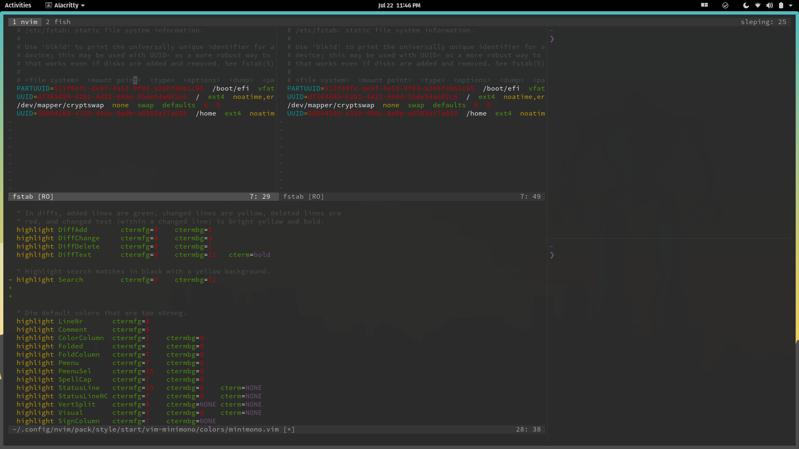

# Vim Minimono

This is a fork of the Vim colorscheme [Dim][1]. Like Dim, it Minimono is a
16-color theme that relies on your terminal colors. However, it tries to go
even further in dimming the default Vim colors, and in addition tries to be
aesthetically compatible with the companion [Tmux colorscheme][2].

Here is a screenshot of the Minimono colorschemes for Vim and Tmux together:

## Quickstart

This is a regular Vim plugin, mainly developed and tested under Neovim 0.5.0.
To install it, just add `jabirali/vim-minimono` with your Vim plugin manager.

[1]: https://github.com/jeffkreeftmeijer/vim-dim
[2]: https://github.com/jabirali/tmux-minimono
